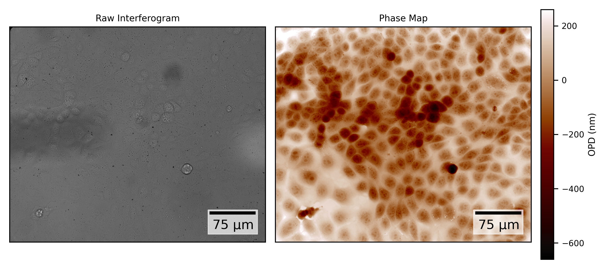

# PyCGM
_Created by Andy Zhang for use in the [Gardel Lab at the University of Chicago](https://squishycell.uchicago.edu/)._

A Python package for optical path difference (OPD) processing using Fourier analysis, based on the MatLab [CGMProcess](https://github.com/baffou/CGMprocess) repository written by Guillaume Baffou, modified to automatically identify first-order points and optimized for repeat processing on the same reference image.

## Installation

```bash
pip install git+https://github.com/andyletzhang/pyCGM
```

## Requirements
- Python >3.6
- NumPy
- pyFFTW
- scikit-image

## Usage

Basic usage example:

```python
import numpy as np
from opd_processor import OPD_Processor

# Create sample image and reference (replace with actual image data)
reference = np.random.random((512, 512))
interferogram = np.random.random((512, 512))

# Initialize the OPD processor
processor = OPD_Processor(ref=reference)

# Compute the optical path difference
opd_map = processor.process(interferogram)

# Display the result
import matplotlib.pyplot as plt
plt.imshow(opd_map)
plt.colorbar()
plt.show()
```
